# Listings

### contents
* [Categories Operation](#categories-operation)
* [Listings View](#listings-view-top)
* [Platform Specific Listings Tables](#platform-specific-listings-tables-top)
* [Calculated Values](#calculated-values-top)
* [Edit View](#edit-view-top)
* [Add Listing](#add-listing-top)
* [Add Prime Listing](#add-prime-listing-top)
* [Courier Lookup](#courier-lookup-top)
* [Competition Columns](#competition-columns-top)
* [URLs Column](#urls-column-top)
* [Add/Edit Skus](#addedit-skus-top)
* [VAT Rates](#vat-rates-top)
* [Platform Fees](#platform-fees-top)
* [Export / Remove](#export--remove-top)
* [View Price matrix](#view-price-matrix-top)
* [Listings DB Tables](#listings-db-tables-top)
* [Stock Control DB Tables](#stock-control-db-tables-top)
* [Add New Product](#add-new-product-top)
* [Add New Listings](#add-new-listings-top)

---------------

## Categories Operation

### Main category drop-down

Data is stored in `cats@stock_control.db3`

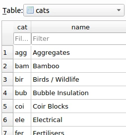
```
<select name="cat">
Aggregates|agg
Bamboo|bam
Birds / Wildlife| bir
Bubble Insulation|bub
Coir Blocks|coi
Electrical|ele
etc.
```

### Sub category drop-down (assuming `Electrical` selected above)

Data is stored in `lookup_prods_cats@listings.db3`

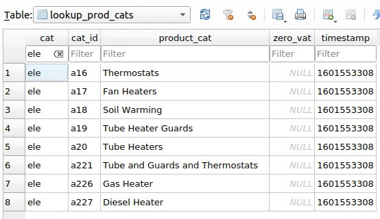
```
<select name="cat_id">
Diesel Heater|a227
Fan Heaters|a17
Gas Heater|a226
Soil Warming|a18
etc.
```
Data from the above tables is sorted alphabetically before displaying in the listings view drop-downs:


---------------

## Listings View [[top]](#listings)

The listings view is created from several database tables.

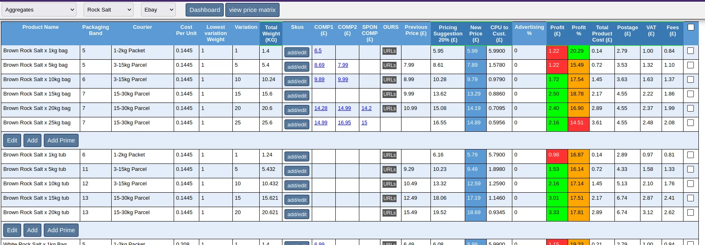

`listings@listings.db3` is common to all platforms (Ebay, Amazon etc):

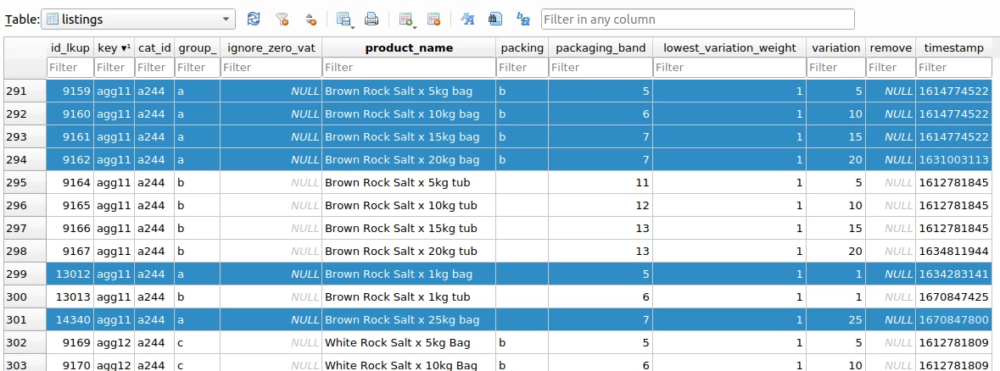

In the Aggregates/Rock Salt example, Rock Salt's drop-down value is "a244" `<option value="a244" selected="">Rock Salt</option>` so 'listings' table records whose 'cat_id' equals 'a244' are selected.

The listing view sorts the results into groups. The first group are those whose 'group_' value equals 'a' (highlighted above). They're sort alphabetically by 'product_name' before displaying.

4 columns from the listings table are displayed in the listings view:

* product_name
* packaging_band
* lowest_variation_weight
* variation

### Platform Specific Listings Tables [[top]](#listings)

Specific platform data (prices, notes etc) is stored in individual platform tables. Selecting 'Ebay' in the drop-down, for example, retrieves the records from the 'listings_ebay' table. The 'id' values in 'listings_ebay' are matched to the 'id_lkup' values in 'listings'. The following are group 'a' records:

`listings_ebay@listings.db3`


4 columns from the listings_ebay table are displayed in the listings view:

* prev_price
* new_price
* perc_advertising
* notes

*** There is no 'notes' column in the listings view. Records that have note values display a notes icon in the 'Product Name' column. An icon mouseover causes the note's message to pop-up:


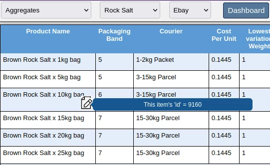

### Calculated Values [[top]](#listings)

Columns with dark blue headings (*Total Weight*, *Pricing Suggestion*, *New Price* etc) are calculated.

| Total Weight | Pricing Suggestion | New Price | CPU to Cust. | Profit (£) | Profit % |
| ------------ | ------------------ | --------- | ------------ | ---------- | -------- |
| Variation x Lowest Variation Weight + Lookup Weight of Packaging Band | (Postage + Total Product Costs) x Lookup value in config_fees relating to platform (2.362205 or 2.542372) | ONLY IF NO VALUE IN DB - Give cheapest COMP, IF No COMP Give Prev Price, IF No Prev Price Give Price Suggestion | New Price ÷ Variation | New Price - SUM(Total Product Cost, Postage, VAT, Fees, PP1, PP2) | Profit ÷ New Price |


| Total Product Cost | Postage | VAT | Fees | PP1 | PP2 |
| ------------------ | ------- | --- | ---- | --- | --- |
| Cost Per Unit x Variation | (Courier Cost + Postage Band Cost) x Variation / 29.5 | New Price ÷ 6 | Amazon: New Price x 0.17 / Ebay: New Price x 0.14 | New Price x 0.17 | TBD |


---------------

## Edit View [[top]](#listings)

Clicking the `Edit` button below a category group (Listings View) displays the `Edit View` - essentially an editable version of the `Listings View`:

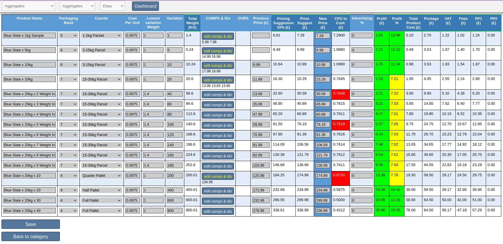

JavaScript/jQuery allows calculated values to update in real time when editable values are modified.

The following 9 fields have editable text inputs:
* Product Name
* Packaging Band
* Courier
* Cost Per Unit
* Lowest variation Weight
* Variation
* Previous Price (£)
* New Price (£)
* Advertising %

### Edit Comps and IDs

However, `COMP & IDs` can also be edited by clicking an item's `edit comps & ids` button to display a modal pop-up.


The pop-up allows up to 3 competition prices to be added, along with their URL IDs. The prices appear in the COMP1, COMP2 & SPON COMP columns (Listings View). See [Competition Columns](#competition-columns-top). The prices are actually links to the competition listings. In the example shown, £5.99 links to [https://www.ebay.co.uk/itm/391208794732](https://www.ebay.co.uk/itm/391208794732) and £7.98 links to [https://www.ebay.co.uk/itm/171869007392](https://www.ebay.co.uk/itm/171869007392):


Competition TYPE can also be selected. There are 4 options - "***Like 4 Like***" being the default:

- Like 4 Like
- Cheapest
- Most Popular
- Out of Stock

Listings that have competition prices set, display `edit comps & ids` buttons with green text. Since the prices are now displayed below each button, strictly speaking, this isn't required anymore.

Buttons displaying a dotted white border indicate modified unsaved comps:

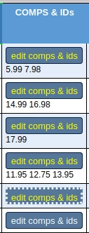


---------------

## Add Listing [[top]](#listings)

New items can be added to an existing listing group by clicking the `Add` button:

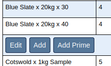

This displays the add listing page:

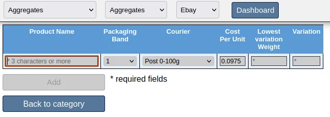

If a group's 'Cost Per Unit' values are all the same, the `Cost Per Unit` value is automatically prepopulated.

All fields can have existing values (including `Product Name`), but the `Variation` must be unique. An error message is displayed if the value already exists:

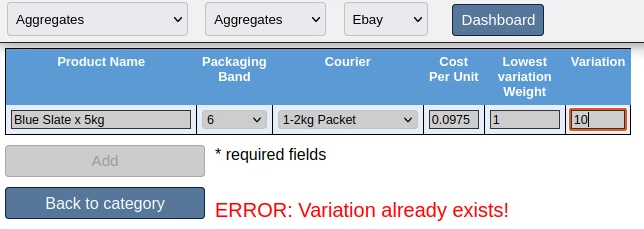

Group listings are sorted by `variation`, so new listings don't necessarily appear at the end of a group.

---------------

## Add Prime Listing [[top]](#listings)

The `Add Prime` button displays the `Add Prime Listings` page:

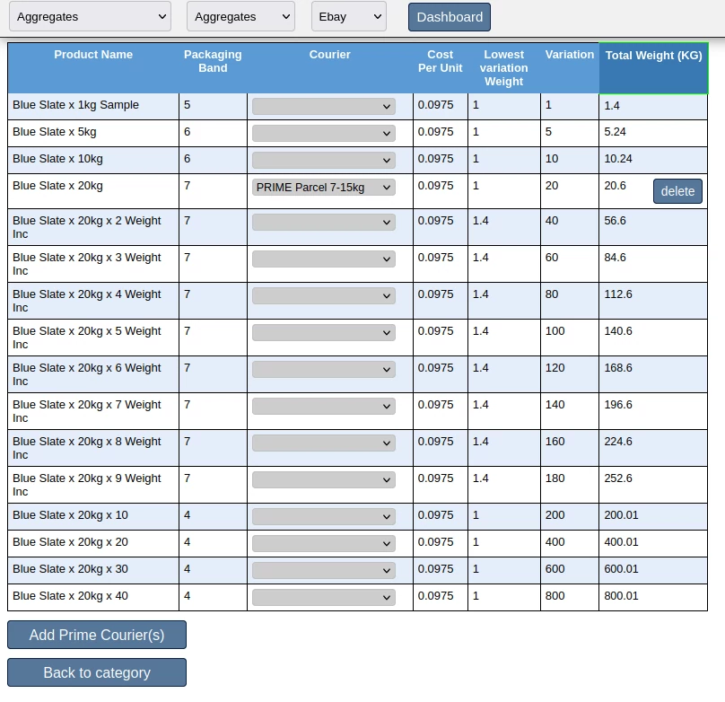

Rather than adding new listings to an existing group, 'Add Prime Listings' allows you to select Prime couriers for the existing listings via a select menu:

```
PRIME Post
PRIME Parcel 0-2kg
PRIME Parcel 2-7kg
PRIME Parcel 7-15kg
PRIME Parcel 15-20kg
PRIME Parcel 20-23kg
```

These get added to the `prime_couriers` table. The following example shows the record for the '***Blue Slate x 20kg***' listing. The actual `courier` value is saved as an integer, which corresponds to the `courier` name's `rowid` in the `lookup_couriers_plus_fuel` table:


---------------

## Courier Lookup [[top]](#listings)

The 'id' values in the 'listings_couriers' table are matched to the 'id_lkup' values in 'listings':

`listings_couriers@listings.db3`


The courier value in 'listings_couriers' can then be matched to the 'rowid' value in the 'lookup_couriers_plus_fuel' table. The corresponding 'name' values are then displayed in the listings view 'Courier' column.

`lookup_couriers_plus_fuel@listings.db3`


Listings view Courier values


**NOTE.** The `listings_couriers` table is not used when '**Prime**' is selected (listings view drop-down). It uses the `prime_couriers` table.

---------------

## Competition Columns [[top]](#listings)

Displays the price of up to 3 competitors. The displayed prices are also links to the competitor's listing (eg. https://www.ebay.co.uk/itm/373442522706).

The lookup is done via the 'id_lkup/listings' > 'id/comps_ids' method used previously.

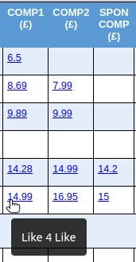

The competition fields that get created via the [Edit Comps and IDs](#edit-comps-and-ids) modal pop-up, get added to `comps_ids@listings.db3`. If all the pop-up COMP and ID fields are cleared (use the `Clear Fields` button to do this with 1 click), clicking `Save` removes the record, for that platform, from the `comps_ids` table.


The id1, id2 & id3 fields contain the link id values that get appended to the URLs. The main URLs can be found in the `$sort_by_profit_urls` array - 'incs/lookups.php'. If the 'source' value is 'e', then 'https://www.ebay.co.uk/itm/' is used. If 'a' then 'https://www.amazon.co.uk/dp/' etc.

```
$sort_by_profit_urls = [
    'e' => 'https://www.ebay.co.uk/itm/',
    'a' => 'https://www.amazon.co.uk/dp/',
    'p' => 'https://www.amazon.co.uk/dp/',
    'w' => 'https://elixirgardensupplies.co.uk/product/',
];
```

The 'type' field values are used to display the correct link titles - appear as a pop-up on mouseover. It uses the `$link_type` array - 'incs/lookups.php'. If 'type1' value equals 1, then a `Like 4 Like` pop-up will appear on mouseover (see previous ***competition.png*** - start of "_Competition Columns_" section).

```
$link_type = [
    '1' => 'Like 4 Like',
    '2' => 'Cheapest',
    '3' => 'Most Popular',
    '4' => 'Out of Stock',
];
```

The link type gets highlighted in the `Listings View` via the competition price background colour:


No background colour indicates 'Like 4 Like':
* Green: Cheapest
* Orange: Most Popular
* Blue: Out of Stock

These are defined in the 'incs/lookups.php' file:

```
$link_colour = [
    '1' => '',
    '2' => 'link_grn',
    '3' => 'link_orange',
    '4' => 'link_blu',
];
```

The $link_color classes are defined in the 'incs/style.css' file:

```
.link_grn{
    background: #0f0;
    color: #000;
}
.link_orange{
    background: #ffa500;
    color: #000;
}
.link_blu{
    background: #00f;
    color: #fff;
}
```


---------------

## URLs Column [[top]](#listings)

Hovering over a URLs label, ('OURS' column) displays 3 links. These link to the Elixir listings on the selected platform (Amazon, Ebay etc). It uses the `$sort_by_profit_urls` array mentioned previously.


The link ids are stored in the `sku_am_eb` table ('stock_control.db3').

`sku_am_eb@stock_control.db3`

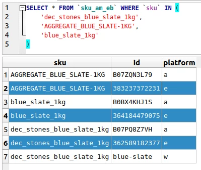

Nb. See [stock_control.db3](#stock-control-db-tables-top) image below to see all tables and fields.

---------------

## Add/Edit Skus [[top]](#listings)

The skus get added by clicking the listing's `add/edit` button ('Skus' column). The skus with checkboxes, that appear in the pop-up, show the skus that have already been added. The 3 skus in this example tally with the 'ids' (ebay platform) on the previous screenshots.

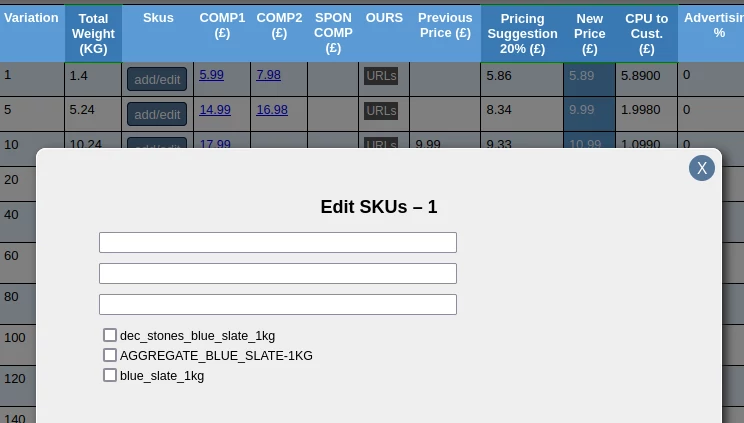

Nb. The number after "***Edit SKUs -***" (1 in this example) indicate the listing `Variation`.

The skus associated with this listing are stored in `skus@listings.db3`:


---------------

## VAT Rates [[top]](#listings)

Some categories can have zero vat - eg. Bird Seed


The rates are set in lookup_prod_cats@listings.db3

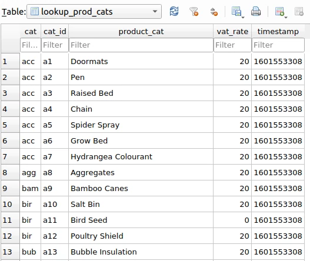

The majority are set to 20 (20%), but any rate can be set.


The vat rate calculation is: new price - new price / (1 + vat rate / 100).

The code is located in `incs/php_functions.php`:


and `js/js_form_fld_calculations.php`:


---------------

## Platform Fees [[top]](#listings)

Platform fees are stored in the `config_fees@listings.db3`.  

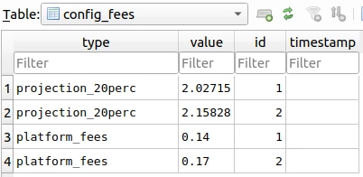

The code that sets the $fees_val is located in `sort_by_profit.php`:


---------------

## Export / Remove [[top]](#listings)

The `Export/Remove` select menu (header bar) defaults to 'Export'. The submit button is disabled until 1 or more listings have been checked.

_**TIP:** All checkboxes on the whole page can be checked by checking the heading checkbox. To check all listings in a single group, check the first checkbox and then the last while holding shift._

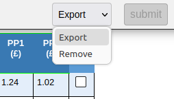

Clicking `submit` creates a comma separated CSV file:

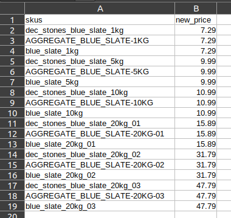

The '***skus***' column contains all the skus associated with the checked listings. The '***new_price***' column displays the sku prices. The prices will be for the selected platform (Amazon, Onbuy etc). However, the price defaults to the Ebay price if no price exists for the selected platform.

clicking `submit`, when the `Remove` option is selected, sets the value in the `listings` table `remove` column to '1'. This stops the listing displaying.


---------------

## View Price matrix [[top]](#listings)

Allows `New Price` values across the whole page to be updated simultaneously. The price matrix table displays the product names in the first column (only the first item in each group) and the prices for each variation in the following columns. The variation values are displayed above each price column - 1, 5, 10 etc.

The second and fourth groups (brown rock salt tubs / white rock salt tubs respectively) don't have a variation value of 25, which is why N/A is displayed in the 25 column for these two groups.

The R1, R2, R3 and R4 boxes are used to calculate price ranges between minimum / maximum values. However, It's not currently working properly so I'm not got to add any further documentation here.


All the prices in each group are displayed horizontally below the item's variation. In this `Rock Salt` example, the 6 prices in the first group for variations: 1, 5, 10, 15, 20, 25 are 7.49, 10.09, 11.69, 16 respectively.

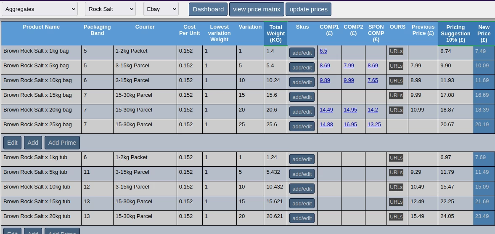

---------------

## Listings DB Tables [[top]](#listings)


---------------

## Stock Control DB Tables [[top]](#listings)

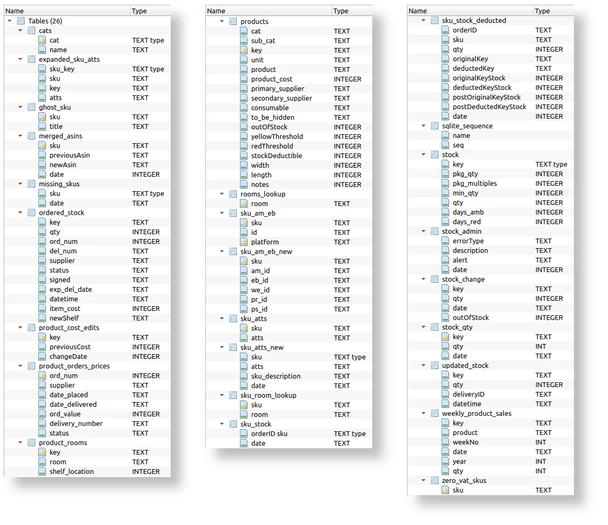

---------------

## Add New Product [[top]](#listings)


Adding a new product updates 4 tables in the `stock_control.db3` database: 'products','product_rooms','stock_qty' & 'stock'.

The following 8 fields (cat, key, unit, product, product_cost, primary_supplier, yellowThreshold, redThreshold), in the `products`, table get added:

![[Image of products_stock_control]](docs/img/products_-_stock_control.db3.webp)


Category, Units, Room and Existing Suppliers drop-downs:

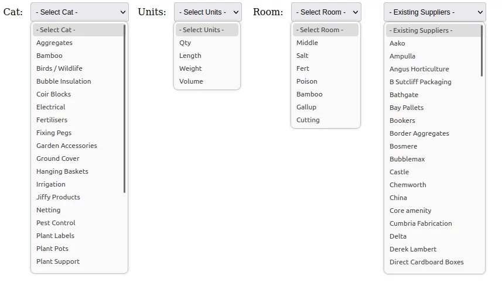

---------------

## Add New Listings [[top]](#listings)

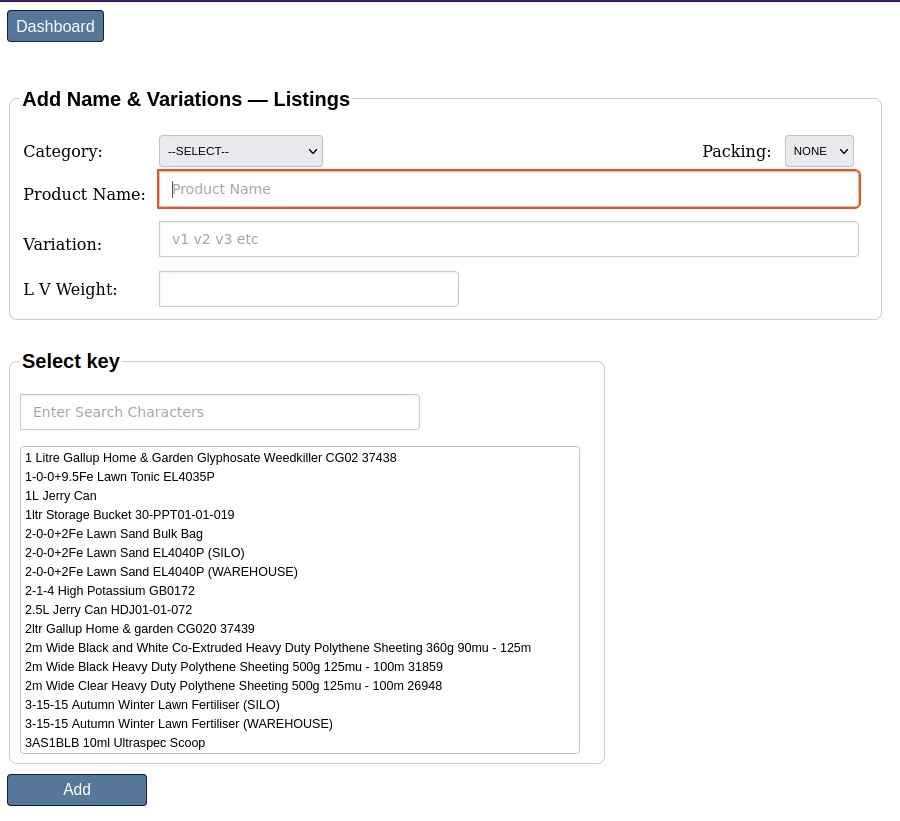
