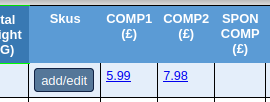
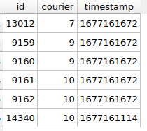
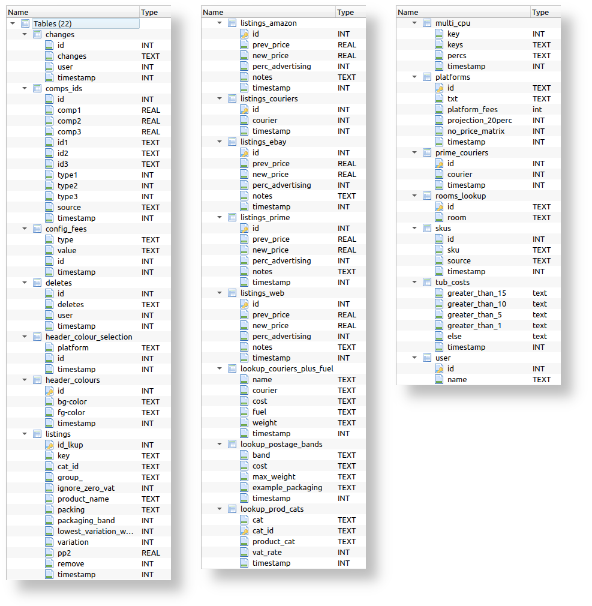

# Listings

#contents
* [Listings DB Tables](#listings-db-tables)
* [Categories Operation](#categories-operation)
* [Listings View](#listings-view)
* [Platform Specific Listings Tables](#platform-specific-listings-tables)
* [Calculated Values](#calculated-values)
* [Edit View](#edit-view)
* [Courier Lookup](#courier-lookup)
* [Competition Columns](#competition-columns)
* [URLs Column](#urls-column)
* [Add/Edit Skus](#addedit-skus)
* [VAT Rates](#vat-rates)
* [Platform Fees](#platform-fees)

---------------

## Categories Operation

### Main category drop-down

Data is stored in `cats@stock_control.db3`


```
<select name="cat">
Aggregates|agg
Bamboo|bam
Birds / Wildlife| bir
Bubble Insulation|bub
Coir Blocks|coi
Electrical|ele
etc.
```

### Sub category drop-down (assuming `Electrical` selected above)

Data is stored in `lookup_prods_cats@listings.db3`


```
<select name="cat_id">
Diesel Heater|a227
Fan Heaters|a17
Gas Heater|a226
Soil Warming|a18
etc.
```
Data from the above tables is sorted alphabetically before displaying in the listings view drop-downs:


---------------

## Listings View

The listings view is created from several database tables.


`listings@listings.db3` is common to all platforms (Ebay, Amazon etc):


In the Aggregates/Rock Salt example, Rock Salt's drop-down value is "a244" `<option value="a244" selected="">Rock Salt</option>` so 'listings' table records whose 'cat_id' equals 'a244' are selected.

The listing view sorts the results into groups. The first group are those whose 'group_' value equals 'a' (highlighted above). They're sort alphabetically by 'product_name' before displaying.

4 columns from the listings table are displayed in the listings view:

* product_name
* packaging_band
* lowest_variation_weight
* variation

### Platform Specific Listings Tables

Specific platform data (prices, notes etc) is stored in individual platform tables. Selecting 'Ebay' in the drop-down, for example, retrieves the records from the 'listings_ebay' table. The 'id' values in 'listings_ebay' are matched to the 'id_lkup' values in 'listings'. The following are group 'a' records:

`listings_ebay@listings.db3`


4 columns from the listings_ebay table are displayed in the listings view:

* prev_price
* new_price
* perc_advertising
* notes

*** There is no 'notes' column in the listings view. Records that have note values display a notes icon in the 'Product Name' column. An icon mouseover causes the note's message to pop up:


### Calculated Values

Columns with dark blue headings (*Total Weight*, *Pricing Suggestion*, *New Price* etc) are calculated.

| Total Weight | Pricing Suggestion | New Price | CPU to Cust. | Profit (£) | Profit % |
| ------------ | ------------------ | --------- | ------------ | ---------- | -------- |
| Variation x Lowest Variation Weight + Lookup Weight of Packaging Band | (Postage + Total Product Costs) x Lookup value in config_fees relating to platform (2.362205 or 2.542372) | ONLY IF NO VALUE IN DB - Give cheapest COMP, IF No COMP Give Prev Price, IF No Prev Price Give Price Suggestion | New Price ÷ Variation | New Price - SUM(Total Product Cost, Postage, VAT, Fees, PP1, PP2) | Profit ÷ New Price |


| Total Product Cost | Postage | VAT | Fees | PP1 | PP2 |
| ------------------ | ------- | --- | ---- | --- | --- |
| Cost Per Unit x Variation | (Courier Cost + Postage Band Cost) x Variation / 29.5 | New Price ÷ 6 | Amazon: New Price x 0.17 / Ebay: New Price x 0.14 | New Price x 0.17 | TBD |


---------------

## Edit View

Clicking the `Edit` button below a category group (Listings View) displays the `Edit View` - essentially an editable version of the `Listings View`:


JavaScript/jQuery allows calculated values to update in real time when editable values are modified.

The `edit comps & ids` buttons display a modal popup:


The popup allows up to 3 competition prices to be added, along with their URL IDs. The prices appear in the COMP1, COMP2 & SPON COMP columns (Listings View). The prices are actually links to the competition listings. In the example shown, £5.99 links to `https://www.ebay.co.uk/itm/391208794732` and £7.98 links to `https://www.ebay.co.uk/itm/171869007392`:



Competition TYPE can also be selected. There are 4 options - `Like 4 Like` being the default:

- Like 4 Like
- Cheapest
- Most Popular
- Out of Stock

Listings that have competition prices set, display `edit comps & ids` buttons with green text. Since the prices are now displayed below each button, strictly speaking, this isn't required anymore.

Buttons displaying a dotted white border indicate modified unsaved comps.


---------------

## Courier Lookup

The 'id' values in the 'listings_couriers' table are matched to the 'id_lkup' values in 'listings':

`listings_couriers@listings.db3`



The courier value in 'listings_couriers' can then be matched to the 'rowid' value in the 'lookup_couriers_plus_fuel' table. The corresponding 'name' values are then displayed in the listings view 'Courier' column.

`lookup_couriers_plus_fuel@listings.db3`


Listings view Courier values


**NOTE.** The `listings_couriers` table is not used when '**Prime**' is selected (listings view drop-down). It uses the `prime_couriers` table.

---------------

## Competition Columns

Displays the price of up to 3 competitors. The displayed prices are also links to the competitor's listing (eg. https://www.ebay.co.uk/itm/373442522706).

The lookup is done via the 'id_lkup/listings' > 'id/comps_ids' method used previously.


`comps_ids@listings.db3`


The id1, id2 & id3 fields contain the link id values that get appended to the URLs. The main URLs can be found in the `$sort_by_profit_urls` array (`incs/lookups.php`). If the 'source' value is 'e', then 'https://www.ebay.co.uk/itm/' is used. If 'a' then 'https://www.amazon.co.uk/dp/' etc.

```
$sort_by_profit_urls = [
    'e' => 'https://www.ebay.co.uk/itm/',
    'a' => 'https://www.amazon.co.uk/dp/',
    'p' => 'https://www.amazon.co.uk/dp/',
    'w' => 'https://elixirgardensupplies.co.uk/product/',
];
```

The 'type' field values are used to display the correct link titles - appear as a pop up on mouseover. It uses the `$link_titles` array (`incs/lookups.php`). If 'type1' value equals 1, then a `Like 4 Like` pop up will appear on mouseover (see previous **competition.png**).

```
$link_titles = [
    '1' => 'Like 4 Like',
    '2' => 'Cheapest',
    '3' => 'Most Popular',
    '4' => 'Out of Stock',
];
```

---------------

## URLs Column

Hovering over a URLs label, ('OURS' column) displays 3 links. These link to the Elixir listings on the selected platform (Amazon, Ebay etc). It uses the `$sort_by_profit_urls` array mentioned previously.


The link ids are stored in the `sku_am_ebb` table ('stock_control.db3').

`sku_am_ebb@stock_control.db3`


---------------

## Add/Edit Skus

The skus get added by clicking the listing's `add/edit` button ('Skus' column). The skus with checkboxes, that appear in the pop up, show the skus that have already been added. The 3 skus in this example tally with the 'ids' (ebay platform) on the previous screenshots.


---------------

## VAT Rates

Some categories can have zero vat - eg. Bird Seed


The rates are set in lookup_prod_cats@listings.db3


The majority are set to 20 (20%), but any rate can be set.


The vat rate calculation is: new price - new price / (1 + vat rate / 100).

The code is located in `incs/php_functions.php`:


and `js/js_form_fld_calculations.php`:


---------------

## Platform Fees

Platform fees are stored in the `config_fees@listings.db3`.  


The code that sets the fees_val is located in `sort_by_profit.php`:


---------------

## Listings DB Tables


